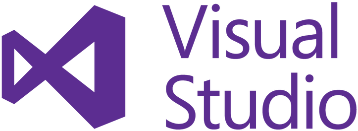

# NoveList
  NoveList is a website designed for readers to keep track of the novels they have read, log start- and finish-dates, make notes on their reading, and connect with friends.

## Table of Contents
  * [Project Requirements and Features List](#project-requirements-and-features-list)
  * [Technologies Used](#technologies-used)
  * [Installing and Launching NoveList](#instructions-for-installing-NoveList)
  * [Appendix 1: Planning Documentation](#appendix-1-planning-documentation)
    * [Entity Relationship Diagrams](#entity-relationship-diagram)
    * [Wireframes](#wireframes)
  * [Appendix 2: Set Up Instructions](#appendix-2-set-up-instructions)

## Project Requirements and Features List
### Get Started
When a user first registers an account with NoveList they will be directed to a welcome page.  Will go to the Search option in the NavBar and search for their first novel to begin their library.  A user may also search for friends.


### Care Cards
Once a user has added one or more books to their library they can navigate to Novels to see a list of their added titles. From here they can click the novel's title to see a detail view of that book, including notes they have added and a list of friends who have also sheved the book.  


## Technologies Used
  ### Development Languages and Libraries
  </img> </img> </img> </img> </img> </img> </img> 
  </img> </img>

  ### Development Tools
 
  </img>  </img>
  </img> </img> </img> 
  

## Instructions for Installing NoveList
  To launch the KaBloom app, you will need to have access to command line tools, node package manager, JSON Server. If you do not have access to any of these tools, you can find instructions for installing them in the [Appendix.](#appendix-2-set-up-instructions)

  Clone this repo on you personal machine using the following command
  ```sh
    git clone git@github.com:xine75/NoveList.git
  ```

  Install the NPM dependencies for this project using the following commands
  ```sh
    cd NoveList
    npm install
  ```

  From your terminal window, type
  ```sh
    npm start
  ```

  Now that the server is up and running, you can open an internet browser and access the application
  ```sh
    http://localhost:8080/
  ```

 ### Congratulations you are now experiencing NoveList!

  ## Appendix 1: Planning Documentation

  ### Entity Relationship Diagram
  

  ### Wireframes/ Mockups
  </img> 


  ## Appendix 2: Set Up Instructions

  You will need to have command line tools installed for your computer to use terminal commands.

  Linux/ Windows users, please visit the [Git page](https://git-scm.com/book/en/v2/Getting-Started-Installing-Git) and follow the instructions for set up

  Mac users follow the instructions below

  Open your terminal and type
  ```sh
    git --version
  ```

  You will now need to configure your git account. In the terminal window, type:
  ```sh
    git config -global user.name "Your Name"
    git config -global user.email "Your Email"
  ```

  If you do not have Node.js installed on your machine, visit the [Node.js Download Page](https://nodejs.org/en/download/) and  follow the instructions. To ensure that it is installed correctly, in your terminal window, type
  ```sh
    echo $PATH
  ```
  Ensure that the result has the following in the $PATH
  ```sh
    /usr/local/bin
    or
    /usr/local/bin:/usr/bin:/bin:/usr/sbin:/sbin
  ```

  Now you can follow the [installation instructions](#instructions-for-installing-NoveList) to get KaBloom up and running on your machine.

  This project was bootstrapped with [Create React App](https://github.com/facebook/create-react-app).
